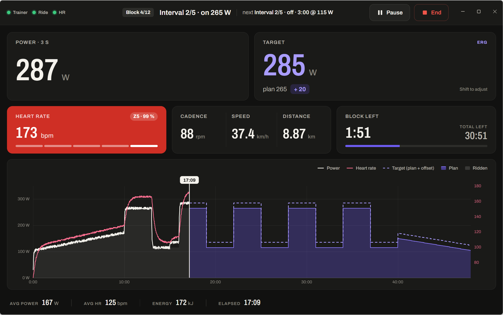
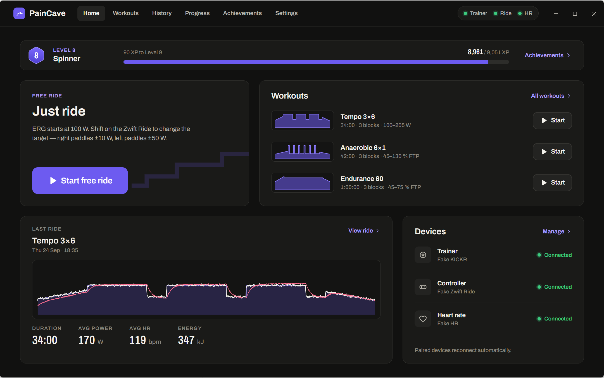
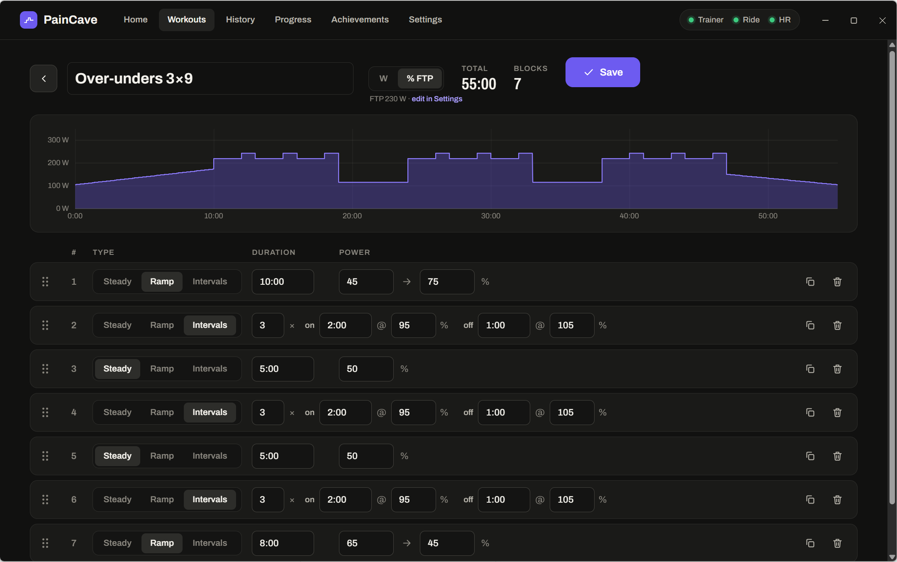
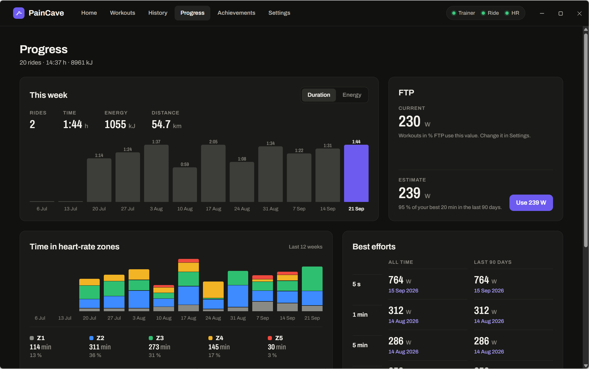
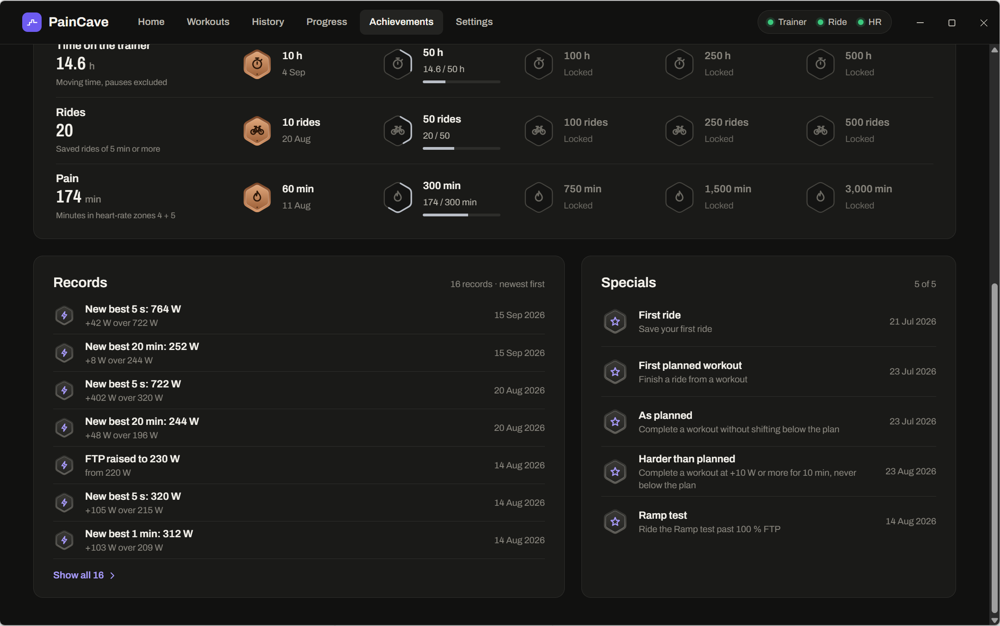
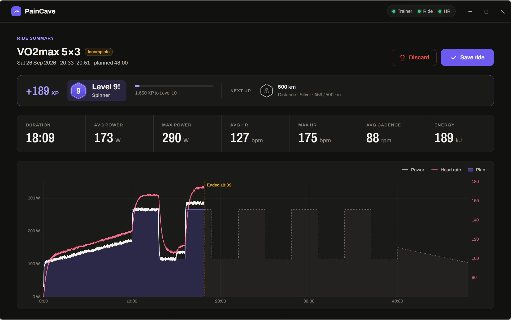
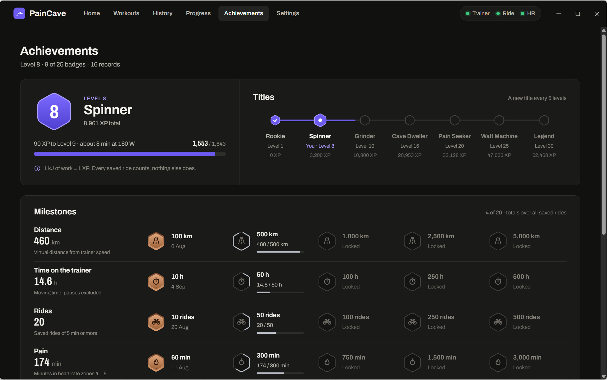

<p align="center">
  
</p>

<h1 align="center">PainCave</h1>

<p align="center">
  <b>Structured ERG training for the Zwift Ride and the Wahoo KICKR CORE 2 — no subscription.</b><br>
  Your shifters become watt controls, your workouts live on your laptop, your data stays yours.
</p>

<p align="center">
  <a href="https://github.com/abrueniger/pain-cave/releases/latest"><b>Download for macOS / Windows</b></a> ·
  <a href="#features">Features</a> ·
  <a href="#development">Development</a>
</p>



## Why

The Zwift Ride is a great smart frame — but without a Zwift subscription its virtual shifting and
handlebar controllers go quiet. PainCave talks to the hardware directly over Bluetooth and turns it
into a focused training tool: the KICKR holds your target power in **ERG mode**, and the Ride's
shift paddles change that target instead of virtual gears — **left ±50 W, right ±10 W**.

No account, no cloud, no game world. A big, glanceable screen in front of you, a workout that tells
you what's coming next, and a history that shows whether you're getting fitter.

## Features

**Ride**
- **Free ride** — starts at 100 W, shift up and down as you go.
- **Planned workouts** — the whole profile ahead of you, a "now" marker, the current and next block,
  and a 5-second countdown with beeps before every block change. Shifting adds an offset to the
  rest of the workout when you feel strong (or don't).
- **Big, condensed numbers** readable from the saddle: 3-s power, target, heart rate tile coloured
  by zone, cadence, speed, distance, block time left.
- **Auto-pause** when you stop pedaling, **keeps the display awake**, reconnects dropped devices,
  and never loses a ride — samples are written every few seconds.

**Workouts**
- **Builder** with steady, ramp and **interval** blocks, drag & drop (hold ⌥/Alt to copy),
  live profile preview, in **watts or % FTP**.
- **15 classic workouts** included — sweet spot, over-unders, threshold, VO2max 30/30s, Tabata,
  pyramid, a ramp test and more.
- **Import `.zwo` files** from Zwift, intervals.icu, TrainerDay or anywhere else.

**Progress**
- Weekly volume, time in heart-rate zones, best efforts (5 s · 1 · 5 · 20 min).
- **FTP estimate** from your best 20 minutes — one click to apply it to all % FTP workouts.
- **Fitness per workout**: ERG keeps the power fixed, so your heart rate is the signal. Ride the same
  workout again and see "−6 bpm at the same power since August".

**Achievements**
- **Levels** — 1 kJ of work = 1 XP, from *Rookie* to *Legend*.
- **Milestones** for distance, time, rides and *pain* (minutes in zones 4–5), records for new bests,
  and specials like *As planned* or *Harder than planned*. Everything is derived from your rides.

| | |
|---|---|
|  |  |
|  |  |
|  |  |

## Hardware

| Device | Status |
|---|---|
| Wahoo KICKR CORE 2 | target device — FTMS over Bluetooth, ERG verified on hardware |
| Zwift Ride handlebar controllers | target device — protocol verified on hardware |
| Other FTMS smart trainers | should work, untested |
| Bluetooth heart rate straps | standard Heart Rate Service |

- Close the Wahoo app, Zwift and Zwift Companion before riding — the trainer and the controllers
  accept only one app at a time.
- Zwift Ride controller firmware newer than 1.2.0 reportedly hides the controller service — avoid
  updating it via Zwift Companion.
- Pair your devices once under **Settings**; they reconnect automatically on the next start.

**Keyboard fallback during a ride:** ↑/↓ ±10 W · Shift+↑/↓ ±50 W · Space pause/resume.

## Install

Grab the latest build from [**Releases**](https://github.com/abrueniger/pain-cave/releases/latest):
the `.dmg` for macOS (Apple Silicon) or the `.zip` for Windows.

The builds are not code-signed:
- **macOS** — right-click the app → *Open* the first time, or run `xattr -cr /Applications/PainCave.app`.
- **Windows** — SmartScreen: *More info* → *Run anyway*.

**Your data** lives outside the app, so updating is safe:
`~/Library/Application Support/PainCave/paincave.db` (macOS) or `%APPDATA%\PainCave\paincave.db`
(Windows). Schema changes run as versioned migrations on start, and PainCave keeps a backup copy
of the database next to it before each one.

## Development

Requires Node 24+.

```bash
npm install
npm run dev:fake   # simulated trainer, controller and HR strap (F8 toggles pedaling)
npm run dev        # real Bluetooth devices
npm test           # vitest
npm run typecheck
npm run build:mac  # on a Mac → dist/PainCave-<version>-arm64.dmg
npm run build:win  # → dist/win-unpacked/PainCave.exe
```

- **Stack:** Electron + React + TypeScript, Web Bluetooth, uPlot, SQLite via the built-in
  `node:sqlite` (no native modules).
- **CI:** every push runs typecheck + tests and builds the macOS app
  ([Actions](https://github.com/abrueniger/pain-cave/actions/workflows/ci.yml)).
- **Releasing:** bump `version` in `package.json`, then push a matching tag —
  `git tag v0.2.0 && git push origin v0.2.0` — and the
  [release workflow](.github/workflows/release.yml) publishes the macOS dmg and the Windows zip.
- **Docs:** [spec and verified hardware protocol](docs/spec.md) ·
  [design system](docs/design.md) · [gamification](docs/design-gamification.md).
  The `spike/` folder holds the Python/bleak scripts used to reverse-check the protocols.

## Disclaimer

PainCave is an independent project. It is not affiliated with, endorsed by or sponsored by
Zwift, Inc. or Wahoo Fitness. "Zwift", "Zwift Ride", "Wahoo" and "KICKR" are trademarks of their
respective owners and are used only to describe compatibility.
